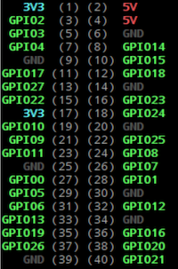

# Proximity Sensor

Play a sound when a person walks by the Raspberry Pi

[Video of sensor in action](https://photos.app.goo.gl/35ev7KiGqmvKVmcG9)

## Design

The hardware setup is based on:

[HC-SR04 Ultrasonic Range Sensor on the Raspberry Pi](https://www.modmypi.com/blog/hc-sr04-ultrasonic-range-sensor-on-the-raspberry-pi)

## Setup

GPIO 5V (pin 2) - orange <=> Sensor VCC - red

GPIO GND (pin 6) - black <=> Sensor GND - black

GPIO 23 (pin 16) - green <=> Sensor TRIG - blue

GPIO 24 (pin 18) - brown <= Voltage Splitter => Sensor ECHO - yellow

PINS:
Orange - blank - Black - blank, blank, blank, blank, Green, Brown

## GPIO Pins

## Running the code

python proximity-sensor.py \<sound_folder\>

Press Ctrl-C to stop.

## Sound folders

When you specifiy the sound folder in the command line, it will randomly play a mp3 file from that folder.  Additional mp3 files can be placed in the appropriate folder and it will automatically be detected.

There are four sound folders:

- bells
- funny
- ringtones
- scary

## Variables

PERCENTAGE_PLAY_SOUND - percentage time a sound will play when triggered
SCAN_DELAY - how long it will wait before scanning with sensor
SAMPLE_SIZE - how many times to scan with sensor for a reading
SCAN_DISCARD - how many scans to discard from the lowest and highest readings

## Debugging

You can test the sensor with:

python distancy.py
